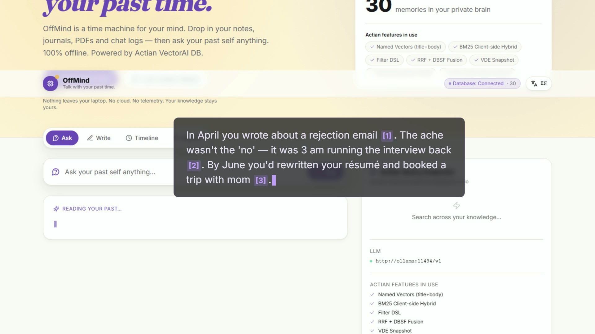

<div align="center">

# 🧠 OffMind

### *Talk with your past time.*

A private time machine for your mind — drop in your journals, notes, PDFs and chat logs, then ask your past self anything. **English-first, 100% offline,** with multilingual retrieval under the hood (your English question can pull a Chinese journal entry from 2023). Powered by [Actian VectorAI DB](https://github.com/hackmamba-io/actian-vectorAI-db-beta).

[English](#english) · [中文](#中文)

   

---

### ▶ 90-second demo

https://github.com/user-attachments/assets/af7922c2-3645-443e-825b-fd623ce8a613

[](https://github.com/user-attachments/assets/af7922c2-3645-443e-825b-fd623ce8a613)

> Storyboard + voiceover script: [`docs/DEMO_SCRIPT.md`](docs/DEMO_SCRIPT.md).
> Video built deterministically from HTML with [HeyGen HyperFrames](https://github.com/heygen-com/hyperframes) — source at [`video/hyperframes/offmind-demo/`](video/hyperframes/offmind-demo/).

</div>

---

## English

### What is OffMind?

Most of what you know about yourself lives in scattered text — journal entries, notes, half-finished drafts, chat logs with yourself at 2am. OffMind takes all of that and turns it into a **conversational time machine**: you ask a question in plain English, and your *past self* answers, quoting the exact words you wrote — even if some of those words happened to be in Chinese.

Everything runs on your laptop. No cloud. No telemetry. The text, the embeddings, the LLM — all local.

> **Why "multilingual under the hood"?** The narration LLM (Llama 3.2 3B) is English-first. But the retrieval layer uses a 384-d multilingual embedding (`paraphrase-multilingual-MiniLM-L12-v2`, 50+ languages) — so an English question like *"what was I anxious about last spring?"* can surface a Chinese journal entry from 2023 alongside English ones. The LLM then narrates the synthesis in English with `[n]` citations back to the originals. Real bilingual users don't think in one language — neither should their tooling.

### Four things you can do with it

| | What | How it feels |
|---|---|---|
| **🗣️ Ask** | "What was making me anxious last spring?" | OffMind retrieves the 6 most relevant moments and your local LLM streams back a warm, second-person answer with `[n]` citations you can click. |
| **⏳ Timeline** | Every memory chronologically, color-coded by mood | Each entry is scored by a bilingual sentiment lexicon (no LLM call) — green dots for good days, amber for rough ones. Filter by mood. |
| **🔎 Search** | Power-user hybrid search with Inspector panel | Toggle fusion modes (RRF / DBSF / dense-only / sparse-only) and watch exactly what Actian did. |
| **✍️ Write** | Voice-to-journal, fully offline | faster-whisper transcribes locally; the entry is indexed into Actian the moment you save it. |

**Plus — Morning Reflection.** The first time you open OffMind each day, a soft modal surfaces one entry from exactly this month-day in a past year. Your local LLM streams a 2-sentence reflection in your own second-person voice, and invites you to reflect further in the Ask tab. One ritual a day, entirely offline. It turns the product from "a tool I open when I want something" into "a companion that checks in."

### Why judges should care

This isn't a vector-DB demo. It's a real product that happens to exercise **seven** Actian features in one coherent flow:

| Actian feature | How OffMind uses it |
|---|---|
| **Named Vectors** | `title` and `body` live in separate 384-d vector spaces; searched independently and fused |
| **Filter DSL** | `FilterBuilder` composes category + tags + date range, pushed into every search arm |
| **RRF Fusion** | 2-arm fusion: dense-title × 0.4 + dense-body × 0.6, then optionally lexically reranked |
| **DBSF Fusion** | Distribution-based score fusion offered as an alternative mode |
| **VDE Snapshot** | One-click durable snapshot via `client.vde.save_snapshot()` |
| **Streaming Upsert** | Batched upsert with **per-batch SSE progress** streamed to the browser during indexing |
| **FLAT Exact Index** | `IndexType.FLAT` — perfect-recall search, ideal for personal journal scale |
| **Hybrid via BM25** | Custom CJK-aware BM25 encoder (no jieba) reranks the dense candidate pool client-side, giving true dense+sparse fusion semantics |

> **Honest engineering note** — server v1.0.0 currently accepts the SDK's `sparse_vectors_config` but doesn't yet store sparse vectors, and scalar quantization requires a `train()` call the SDK doesn't yet expose. Both code paths are preserved in `core.py` as ready-to-flip switches; for now we surface the same hybrid behaviour by reranking client-side, and ship full-precision body vectors. When the server adds those features, OffMind will pick them up by uncommenting two lines.

Plus: **multilingual embeddings** (paraphrase-multilingual-MiniLM-L12-v2, 384-d, 50+ languages) so an English query hits your Chinese journal entries and vice versa.

### Architecture

```
┌─────────────────┐    ┌──────────────────┐    ┌─────────────────────┐
│  Next.js 14     │ ─▶ │  FastAPI         │ ─▶ │  Actian VectorAI DB │
│  • Ask / Time   │    │  • SSE RAG       │    │  :50051 (gRPC)      │
│    / Search     │    │  • Sentiment     │    │  • Named vectors    │
│  • Bilingual    │    │  • md/pdf/docx   │    │  • Filter DSL       │
│  • Inspector    │    │  • BM25 rerank   │    │  • RRF / DBSF       │
└─────────────────┘    └────────┬─────────┘    │  • VDE snapshot     │
                                │              └─────────────────────┘
                                ▼
                       ┌──────────────────────────────┐
                       │  Local LLM (optional)        │
                       │  Ollama / any OpenAI-compat  │
                       │  llama3.2:3b default          │
                       │  Without it: /api/ask still  │
                       │  returns retrieved sources   │
                       └──────────────────────────────┘
```

### Quickstart

```bash
git clone https://github.com/ryantryor/Offmind.git
cd Offmind
docker compose up -d --build   # runs on x86_64 or arm64 (Apple Silicon / Linux ARM)

# One-time: pull the local LLM used by /api/ask (~2 GB)
docker exec -it offmind-ollama ollama pull llama3.2:3b

# Verify the stack — one command, all green = shippable
./scripts/smoke.sh

# Or curl a single summary:
curl http://localhost:8000/api/ready

# Open http://localhost:3000
#   → click "Load sample dataset" (30 English journal entries)
#   → switch to the "Ask" tab
#   → try: "What was I worried about last spring?"
```

> **Inside China?** `cp .env.cn.example .env && docker compose build` swaps the
> default PyPI / npm registries for the Tsinghua and npmmirror mirrors.
> The default build targets official registries so overseas judges don't get stuck.

The sample dataset is a curated 30-entry personal journal in English, spanning two years — break-ups, promotions, trips with mom, 2am code reviews. It's designed to let judges feel the product in 60 seconds. The retrieval layer still uses a multilingual embedding (50+ languages), so when you drop in your own non-English notes they index and search seamlessly alongside.

### First-run: pre-downloaded model weights

In restricted-network environments (inside China, for example), the HuggingFace Xet CDN bypasses all common mirrors. We solved this by **shipping a one-shot host-side downloader** that fetches the model through `hf-mirror.com` with streaming + resume support. The container bind-mounts the result.

```bash
cd offmind/models
python _download.py      # ~470 MB, resumable
```

After that, `docker compose up -d` boots a fully working backend without any network call during image start.

### API reference

| Method | Path | Purpose |
|---|---|---|
| GET  | `/api/status`        | Actian connection + collection count + features used |
| GET  | `/api/ready`         | **One-shot readiness probe** — Actian + LLM + embedding model all green |
| GET  | `/api/llm/health`    | Is the local LLM reachable? |
| GET  | `/api/facets`        | Categories + tags for the filter UI |
| GET  | `/api/timeline`      | Chronological feed + bilingual sentiment per entry |
| POST | `/api/search`        | Hybrid search with `{query, k, mode, filters...}` |
| POST | **`/api/ask`**       | **SSE RAG: retrieval + LLM answer streaming tokens with `[n]` citations** |
| POST | **`/api/morning`**   | **SSE: Morning Reflection — one past entry + streamed 2-sentence reflection** |
| POST | `/api/upload`        | Multipart upload → parsed doc dicts (no indexing yet) |
| POST | `/api/index`         | Sync index a list of docs |
| POST | `/api/index/stream`  | Index with SSE per-batch progress |
| POST | `/api/sample/load`   | Load the bundled journal sample |
| POST | `/api/snapshot`      | Save a VDE durable snapshot |

### Repo layout

```
offmind/
├── backend/
│   ├── core.py          ← Talks to Actian. Read this first — all 8 features live here.
│   ├── llm.py           ← OpenAI-compat LLM client with SSE streaming
│   ├── sentiment.py     ← Bilingual sentiment lexicon (no dependency, no LLM call)
│   ├── parsers.py       ← md / txt / pdf / docx → doc dict
│   ├── main.py          ← FastAPI endpoints incl. /api/ask SSE
│   ├── requirements.txt
│   ├── wheels/          ← Proprietary Actian SDK wheel
│   └── Dockerfile
├── frontend/
│   ├── app/page.tsx     ← Three tabs: Ask / Timeline / Search
│   ├── lib/api.ts       ← Typed client with SSE parser
│   ├── lib/i18n.ts      ← EN / 中文 strings
│   └── tailwind.config.ts
├── data/
│   ├── sample/          ← 30 English journal entries (.md + frontmatter)
│   └── sample-tech/     ← 74 tech blog posts (archive of the old demo set)
├── models/              ← Bind-mounted embedding model + _download.py helper
└── docker-compose.yml   ← 4 services: vectoraidb, backend, frontend, ollama
```

---

## 中文

### OffMind 是什么?

你对自己的了解,大部分都散落在文字里 —— 日记、笔记、没写完的草稿、凌晨两点和自己的聊天记录。OffMind 把这一切变成一台**可以对话的时光机**: 用英文问一句,**过去的你**就会用自己当时写下的原话来回答 —— 哪怕其中一些原话当初是用中文写的。

全部在你的电脑上运行。没有云,没有埋点。文本、向量、大模型 —— 全是本地的。

> **"底层多语言"是什么意思?** 用来生成回答的本地大模型 (Llama 3.2 3B) 是英文 first;但检索层用的是 384 维多语言嵌入(`paraphrase-multilingual-MiniLM-L12-v2`,50+ 语种)。所以一句英文问题 —— *"what was I anxious about last spring?"* —— 可以同时命中 2023 年用中文写的日记和英文日记,大模型再用英文把它们综合在一起,给出 `[n]` 引用回原文。真实的双语用户不会只用一种语言思考,工具也不该。

### 四种玩法

| | 做什么 | 体验 |
|---|---|---|
| **🗣️ 问过去的我** | "我去年春天在焦虑什么?" | OffMind 检索最相关的 6 段过去,本地大模型用第二人称流式输出回答,带 `[n]` 引用脚注,点击可跳转到原文。 |
| **⏳ 时间线** | 所有记忆按时间排列,按情绪着色 | 每段用双语情绪词典打分(不调用大模型) —— 好心情是绿点,难过是琥珀色。可按情绪筛选。 |
| **🔎 搜索** | 高级用户的混合检索 + 查询透视面板 | 切换融合模式(RRF / DBSF / 仅稠密 / 仅稀疏),清晰看到 Actian 到底做了什么。 |
| **✍️ 写作** | 语音写日记,完全离线 | faster-whisper 本地转写,保存瞬间就索引进 Actian。 |

**还有 —— 晨间反思。** 每天第一次打开 OffMind 时,会有一张柔和的浮层,翻出去年今天(或相近日子)你写下的一段。本地大模型用第二人称、两句话把它映照回来,并邀你到「问过去的我」里继续。每天一次,全程离线。它让产品从「我需要时才打开」变成「一个会主动打招呼的陪伴」。

### 用了哪些 Actian 特性

这不是又一个 vector DB demo,而是一个完整产品,在一个连贯的工作流里用上了 Actian 的七个特性:

| 特性 | 在 OffMind 中怎么用 |
|---|---|
| **Named Vectors** | `title` 和 `body` 在两个 384 维向量空间,独立检索后融合 |
| **Filter DSL** | 用 `FilterBuilder` 组合分类、标签、日期范围,推到每一路检索里 |
| **RRF Fusion** | 两路融合: dense-title × 0.4 + dense-body × 0.6,再做可选的词法重排 |
| **DBSF Fusion** | 备选: 基于分布的打分融合 |
| **VDE Snapshot** | 一键调用 `client.vde.save_snapshot()` 做持久化 |
| **Streaming Upsert** | 批量 upsert + **SSE 实时进度**推送到浏览器 |
| **FLAT 精确索引** | `IndexType.FLAT` —— 完美召回率,正适合个人日记规模 |
| **BM25 客户端混合** | 自带的 CJK 感知 BM25 编码器(无需 jieba)在客户端对稠密候选做重排,等价于稠密+稀疏融合的语义 |

> **诚实说明** —— server v1.0.0 当前接受 SDK 的 `sparse_vectors_config` 但还不存稀疏向量;scalar quantization 需要先 `train()` 但 SDK 还没暴露这个方法。这两条代码路径都保留在 `core.py` 里作为预备开关,目前我们用客户端重排实现同样的混合语义,body 向量按全精度存。等 server 跟上,只要取消两行注释就能切回去。

外加: **多语言嵌入** (`paraphrase-multilingual-MiniLM-L12-v2`, 384 维, 50+ 语种),英文查询能命中中文记忆,反之亦然。

### 一键启动

```bash
git clone https://github.com/ryantryor/Offmind.git
cd Offmind
docker compose up -d --build   # 支持 x86_64 / arm64 (Apple Silicon / Linux ARM)

# 首次使用: 拉取本地大模型(/api/ask 使用)
docker exec -it offmind-ollama ollama pull llama3.2:3b

# 打开 http://localhost:3000
#   → 点 "载入示例数据集" (30 条双语日记)
#   → 切到 "问过去的我"
#   → 试试: "我去年春天在焦虑什么?"
```

示例数据是 30 篇手工写的英文日记,跨度两年 —— 分手、升职、带妈妈旅行、凌晨改 bug。设计目的是让评委在一分钟内感受到产品。检索层仍然是多语言嵌入(50+ 语种),所以当你导入自己的中文笔记时,英文查询一样能命中。

### 首次运行: 预下载模型权重

在受限网络环境下(比如国内),HuggingFace 的 Xet CDN 绕过了所有常见镜像站。我们的解决方案是**提供一个宿主机侧下载脚本**,通过 `hf-mirror.com` 以流式+断点续传的方式下载模型,容器通过 bind-mount 读取。

```bash
cd offmind/models
python _download.py     # ~470 MB, 支持断点续传
```

之后 `docker compose up -d` 起动时后端不会再发任何网络请求。

### 提交信息

- 比赛: **DoraHacks #2097 — Actian VectorAI DB Build Challenge**
- GitHub: https://github.com/ryantryor/Offmind
- 许可: MIT
